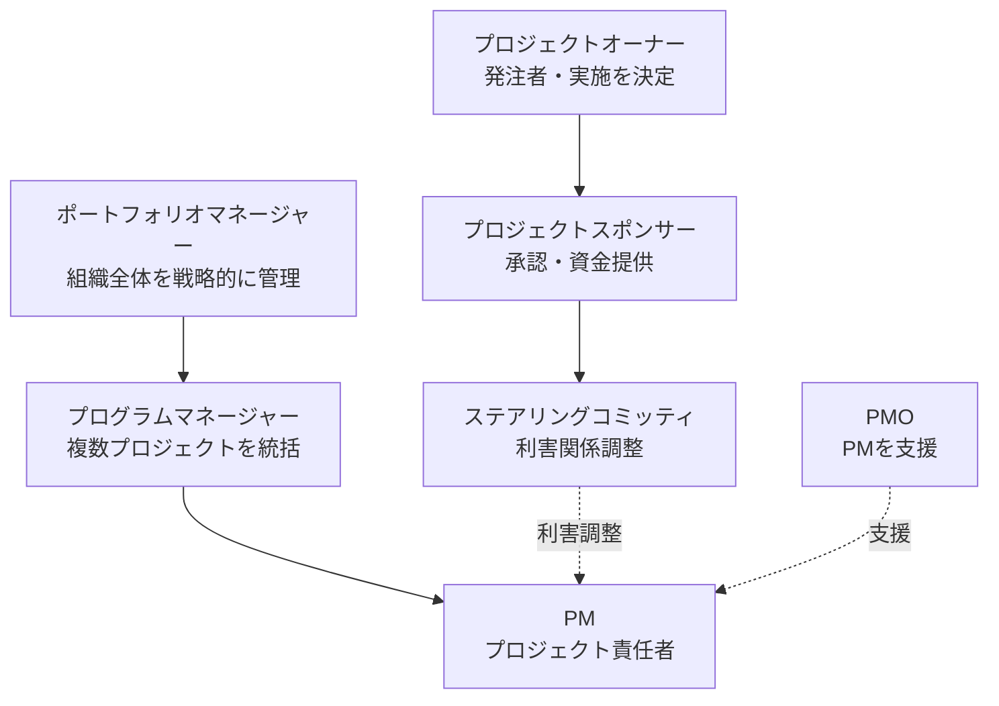

# プロジェクトマネジメント概要

**シラバス大分類：14. プロジェクトマネジメント**

## PMBOK

**PMBOK**（Project Management Body of Knowledge）は、米国PMI（Project Management Institute）が策定したプロジェクトマネジメントの知識体系。プロジェクトを成功させるためのノウハウ集として、世界標準で参照される。

## プロジェクト関係者の役割

### プロジェクトオーナー

プロジェクトの発注者で、プロジェクトの実施を決定する役割。

### プロジェクトスポンサー

プロジェクトを承認する人。資金や経営資源を提供し、上位の意思決定を担う。

### ステアリングコミッティ

利害関係者の代表で構成され、利害関係調整を行う委員会。

### PM（プロジェクトマネージャ）

プロジェクト責任者。計画立案・実行・監視を統括する。

### PMO（Project Management Office）

PMを支援する組織。複数プロジェクトの標準化・支援・教育などを担う。

### ポートフォリオマネージャー

組織全体のプロジェクトやプログラムの**ポートフォリオ**を戦略的に管理する役割。

> **ポートフォリオとは**
> 組織が抱える複数のプログラム・プロジェクト・定常業務などを、経営戦略の達成のために束ねた集合体。個別プロジェクトの成否ではなく、組織全体の投資配分・優先順位を最適化する観点で管理する。

### プログラムマネージャー

複数のプロジェクトを統括して、組織全体の目標を達成する役割。プログラム＝関連する複数プロジェクトの集合。

### 階層構造

組織レベルでは「ポートフォリオ → プログラム → プロジェクト」の階層で管理され、プロジェクト個別の意思決定はオーナー・スポンサー・ステアリングコミッティが担う。

## フェーズゲート

プロジェクトの進行状況を評価し、次のフェーズに進むかどうかを決定するためのチェックポイント。プロジェクトの**継続や中止を判断する**。

### 主な評価基準（ベースライン）

- **スコープ**
- **スケジュール**
- **コスト**

これら3つを「3大ベースライン」と呼び、計画値と実績値を比較して評価する。

## 統合マネジメント

プロジェクトの全ての要素を調整する役割。プロセス群ごとに以下の活動を行う。

| プロセス群 | 主な活動 |
|----------|--------|
| 立ち上げ | プロジェクト憲章の作成 |
| 計画 | 計画書の作成 |
| 実行 | 全体のマネジメント |
| 管理・コントロール | 作業の監視、変更の管理 |
| 終結 | フィードバック |

### 統合管理・変更管理・構成管理

- **統合管理**: 途中で変更がある場合、全体に影響がないかを確認しながら変更を行う。
- **変更管理**: 必要があれば計画の変更を行う。
- **構成管理（コンフィグレーションマネジメント）**: システムを構成するハードやソフトをリスト化して管理する。

## ステークホルダーマネジメント

内外の利害関係者を把握して管理する活動。利害関係者の期待や影響度を分析し、関与の戦略を立てる。

## コミュニケーションマネジメント

利害関係者との円滑なコミュニケーションを取る方法を規定する活動。情報の発信先・タイミング・媒体などをあらかじめ計画する。
